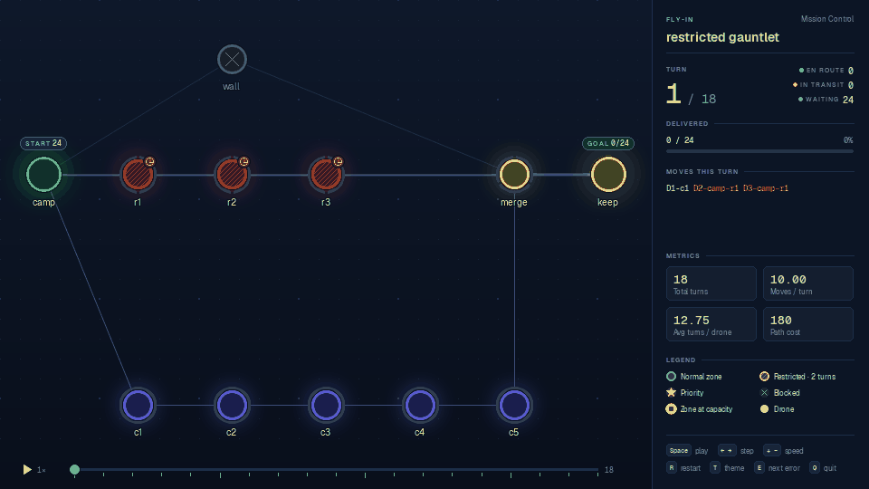

<div align="center">

# ✈ flyin

**Test your 42 Fly-In algorithm and watch it fly.**

[](https://github.com/jasuoh/fly-in-tester-and-visual-adapter/actions/workflows/tests.yml)




[Start](#start) ·
[What it does](#what-it-does) ·
[Without your own visual part](#watch-your-algorithm-before-your-own-visual-part-exists) ·
[Library](#as-a-library) ·
[Reference](docs/REFERENCE.md) ·
[Rules](flyin/RULES.md)

</div>

## Start

```sh
git clone https://github.com/jasuoh/fly-in-tester-and-visual-adapter.git flyin
cd flyin
make
```

The first start installs the visualizer (pygame-ce, into `.venv/`) if you
want, then asks three things and tries your program on one map:

1. **Where is your Fly-In project?**
2. **How is it started for one map?** It guesses: `python3 main.py {map}`,
   `./fly_in {map}`, `python3 -m pkg {map}`, ...
3. **Where does it put the solution?** Terminal, a file it gets as an
   argument (`{out}`), or always the same file (`output.txt`).

If your project has a `maps/` folder with the subject's maps, flyin offers
to import them, with the subject's turn targets. They stay on your
computer: the subject's maps are not part of this repository.

Then the menu: arrow keys, `Enter`, `Esc`. In the map list `Space` marks
several maps and typing filters.

```
╭─ flyin · Fly-In tester & visualizer ──────────────────────╮
│ project      ~/42/fly-in                                  │
│ command      python3 main.py {map}   (terminal)           │
│ last test    2026-10-05 18:42 · 118 pass · 2 warn · 0 fail │
│ subject maps 10 imported                                  │
╰───────────────────────────────────────────────────────────╯
What do you want to do?
↑↓ move · enter choose · esc quit
 ❯   Test all maps                        every map, problems listed
     Watch maps                           your program in the visualizer
   ● Watch the problems of the last test  2 maps
     Compare two solutions                side by side, in sync
     Evaluation report                    checklist + every problem
     More …                               one group, history, random map, rules, subject maps
     Settings                             project, command, output, theme
```

## What it does

| | |
| --- | --- |
| **Test** | Every map is run and judged by an independent checker; only problems are listed. Each solved map shows the exact optimum (where known) or a proven lower bound, and a score says where turns can still be won. |
| **Watch** | Your program runs on the maps you pick and each solution plays in the visualizer: one map, several, or all. |
| **See the mistake** | An invalid solution opens on its first broken turn: the zones and connections involved pulse red, the panel names the rule, `E` jumps to the next one. |
| **Compare** | Two solutions of one map side by side, in sync: your last test against now, or any two files. |
| **History** | After every test: which maps got better or worse than before. |
| **Evaluation report** | One Markdown file with a checklist of the subject's requirements and every problem. |
| **Random maps** | `flyin generate --seed 7`: a solvable map with its lower bound, grid or scattered. |
| **Rules** | [RULES.md](flyin/RULES.md) says how the open points of the subject are read. |

| An invalid solution: the broken rule is marked | Compare: the last test against the one before |
| --- | --- |
|  |  |

## Watch your algorithm before your own visual part exists

Your algorithm only has to print the turn lines (`D1-roof1 D2-corridorA`,
one turn per line). The visualizer reads the map itself, so your data
structures do not matter, and it plays unfinished or wrong solutions too.

```sh
make                                                  # menu → Watch maps
python3 main.py map.txt | python3 start.py show map.txt -
python3 start.py show map.txt my_output.txt
```

Or from your own program while developing, e.g. behind a `--visual` flag:

```python
import sys
import flyin

turns = my_algorithm(map_path)        # list of strings, one per turn
print("\n".join(turns))

if "--visual" in sys.argv:
    flyin.show(map_path, turns)       # opens the window
```

> **For the evaluation:** the subject asks for a visual representation of
> your own. Use flyin to debug your algorithm, not as the visual part you
> hand in: it would be someone else's code in your project.

## As a library

```sh
pip install git+https://github.com/jasuoh/fly-in-tester-and-visual-adapter
pip install pygame-ce        # only for show / compare
```

Without pip: put this repository next to your project and
`sys.path.insert(0, "../flyin")`.

```python
import flyin

map_path = flyin.find_map("city_grid")   # a short name or any map file
turns = my_solver(map_path)

result = flyin.check(map_path, turns)    # every rule of the subject
print(result.valid, result.turns, result.errors)

flyin.show(map_path, turns)              # the visualizer
flyin.compare(map_path, old_turns, turns, labels=("old", "new"))
outcomes = flyin.test("python3 main.py {map}", cwd=".", only="challenge")
```

All functions: [docs/REFERENCE.md](docs/REFERENCE.md#library).

## What your program must do

1. take the map path as an argument (or on stdin with `--shell`);
2. for a solvable map print one line per turn (terminal or file) and exit
   with **0**;
3. for a broken or unsolvable map print an error naming the line to
   stderr and exit with **non-zero**;
4. never open a window and never crash with a traceback.

Any language works: flyin only runs a command. If your program always
opens a window, add a flag like `--no-gui`, or copy
[examples/adapter_template.py](examples/adapter_template.py).

## More

- [docs/REFERENCE.md](docs/REFERENCE.md): every command, the visualizer
  keys, all library functions, how a map is judged, the map groups,
  development.
- [flyin/RULES.md](flyin/RULES.md): the reading of the subject. The
  checker agrees with the independent validator of
  [42-fly-in-claude](https://github.com/jasuoh/42-fly-in-claude) on 4605
  valid and deliberately broken solutions.
- `make dev-test` and `make lint`; CI runs both on Linux and macOS.

The visualizer comes from [42-fly-in-claude](https://github.com/jasuoh/42-fly-in-claude),
the tester from [fly-in-tests](https://github.com/jasuoh/fly-in-tests).
Fonts: SIL Open Font License (`flyin/visual/assets/fonts/OFL-*.txt`).
