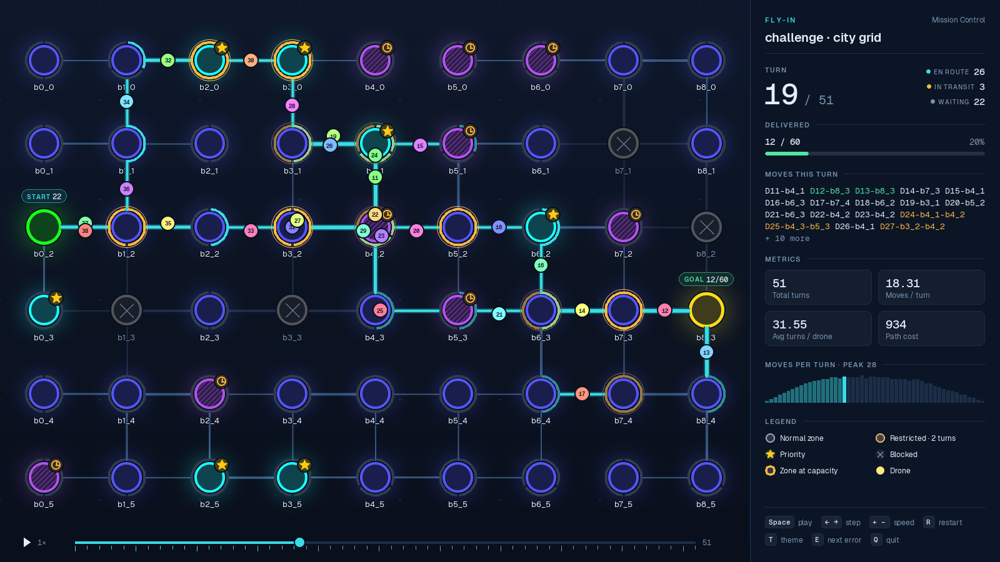
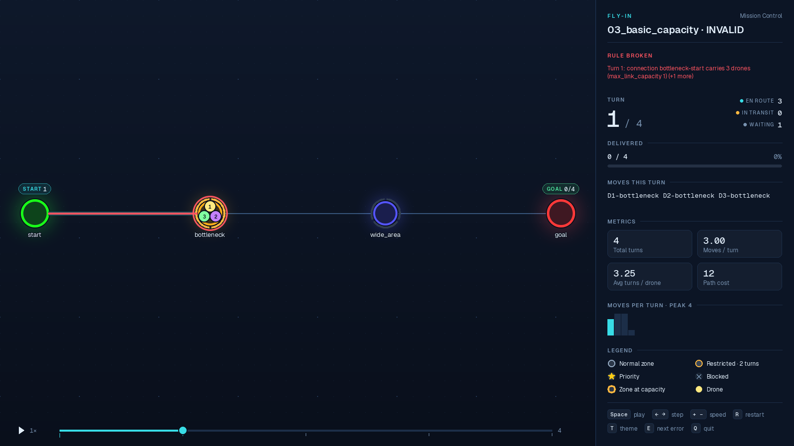
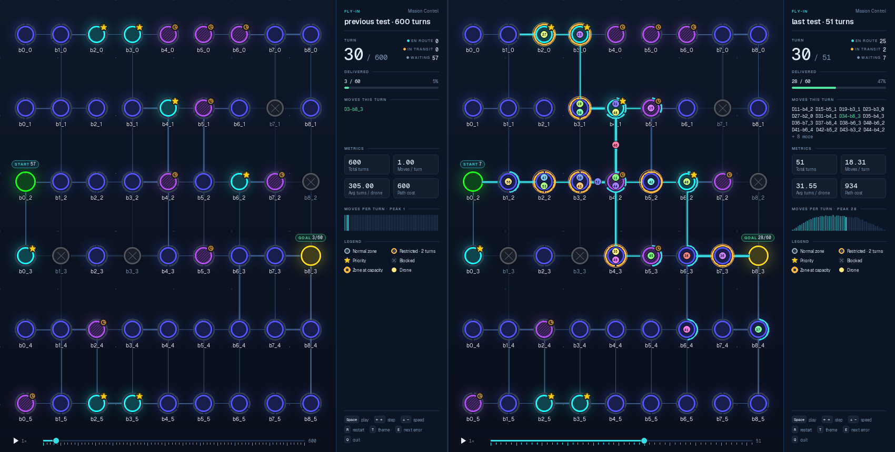

# flyin: Fly-In tester & visualizer

Test your **42 Fly-In** algorithm on 130 maps (+300 with a known
optimum) and **watch it fly**.



## Start

```sh
git clone https://github.com/jasuoh/fly-in-tester-and-visual-adapter.git flyin
cd flyin
make            # or: make run, or: python3 start.py
```

The first start offers to install the visualizer (pygame-ce, into
`.venv/`) and then asks three things:

1. **Where is your Fly-In project?** (the folder)
2. **How is it started for one map?** It guesses the command:
   `python3 main.py {map}`, `./fly_in {map}`, `python3 -m pkg {map}`, ...
3. **Where does it put the solution?** In the terminal, in a file whose
   name it gets as an argument (`{out}`), or always in the same file
   (e.g. `output.txt`).

It tries your program on one map and tells you if something is off. Then
the menu:

```
What do you want to do?
   1  Test all maps
   2  Test one group
   3  Watch maps (your program in the visualizer)
   4  Watch the problems of the last test  (3)
   5  Compare two solutions side by side
   6  Watch an output file
   7  Evaluation report (all maps + checklist)
   8  History of your test runs
   9  Generate a random map
  10  List the maps
  11  How flyin reads the subject (rules)
  12  Settings
   0  quit
```

Your answers are saved in `.flyin/` and can be changed under Settings.

## What it does for you

- **Test**: every map is run and judged by an independent checker. Only
  problems are listed; at the end a **score** sums your turns against the
  exact optimum (where known) or a proven **lower bound**, so you see
  where turns can still be won.
- **Watch**: your program runs on the maps you pick (one, `1,3,5`, `2-6`
  or `all`) and each solution plays in the visualizer.
- **See the mistake**: an invalid solution opens paused on the first
  broken turn; the zones and connections involved pulse red, the panel
  names the rule, red dots on the timeline mark every broken turn and `E`
  jumps to the next one.
- **Compare**: two solutions of one map side by side, in sync: your last
  test against now, the one before against the last, or any files.
- **History**: after every test you see which maps got better or worse
  than in the run before (`flyin history` lists all runs).
- **Evaluation report**: one Markdown file with a checklist of the
  subject's requirements (solves, rejects, line numbers, no crash, no
  timeout, targets), results, score, slowest maps and every problem.
- **Random maps**: `flyin generate --seed 7` writes a solvable map with
  its lower bound; the same seed always gives the same map.
- **Rules**: [flyin/RULES.md](flyin/RULES.md) says how the open points of
  the subject are read (capacity when leaving, flights, link counting).

| An invalid solution: the broken rule is marked | Compare: the last test against the one before |
| --- | --- |
|  |  |

That is all you need. The rest of this page is reference.

## Watching your algorithm

The visualizer plays **whatever your program prints**:

- drone ids from `D0` or `D1`, debug prints and banners around the turns
  are fine;
- **invalid solutions are shown too**, so you can watch the mistake: an
  overfull zone shows `3/2`, the title says `INVALID` and the terminal
  lists every broken rule with its turn;
- only what cannot be drawn at all (an unknown zone, a drone moving twice
  in one turn) is left out and listed.

| Key | |
| --- | --- |
| `Space` | play / pause |
| `←` `→` | one turn back / forward |
| `+` `-` | speed |
| `R` | restart |
| `T` | theme: `mission`, `blueprint`, `graphite`, `ashen` |
| `E` | jump to the next broken rule (invalid solutions) |
| mouse | drag the timeline, hover a zone for details |
| `Esc` | close (with "problems": on to the next map) |

No display (SSH, a server)? Save a picture instead:
`python3 start.py show easy/01 --screenshot frame.png --turn 3`.

## Without the menu

Every menu entry is also a command (`python3 start.py ...`, or `flyin ...`
after `pip install`, or `make ...`):

| Command | |
| --- | --- |
| `setup [PROJECT] [--cmd "..."] [--output-file FILE]` | connect your project |
| `test [WHAT ...] [-v] [--strict] [--show]` | all maps, a group (`challenge`, `fuzz`) or part of a name (`hard`); `-v` lists every map, not only problems |
| `show MAP` | run your program on a map and watch it |
| `show MAP OUTPUT` | watch an output file (`-` = stdin) |
| `show --problems` | watch every map of the last test that failed or missed its target |
| `compare MAP [A] [B]` | two solutions side by side; `now`, `last`, `previous` or a file (default `last now`) |
| `eval [-o FILE]` | evaluation report (`flyin-report.md`) |
| `history` | results of all earlier test runs |
| `generate [--seed N] [--size 8x4] [--drones N]` | a random solvable map in `maps-generated/` |
| `rules` | how flyin reads the subject |
| `maps [WHAT]` | list the maps with their targets |
| `check MAP OUTPUT` | check an output without watching |
| `run --cmd "..." [options]` | the full tester for scripts and CI (`run --help`) |

`MAP` is a file or a short name of a bundled map: `easy/01`,
`city_grid`, `hard/03`.

## As a library

```sh
pip install git+https://github.com/jasuoh/fly-in-tester-and-visual-adapter
pip install pygame-ce        # only for flyin.show
```

```python
import flyin

turns = my_solver("maps/easy.txt")       # your code: one string per turn

result = flyin.check("easy/01", turns)   # every rule of the subject
print(result.valid, result.turns, result.errors)

flyin.show("easy/01", turns)             # opens the visualizer
flyin.show("easy/01", turns, screenshot="turn3.png", turn=3)
flyin.compare("easy/01", old_turns, turns, labels=("old", "new"))

outcomes = flyin.test("python3 main.py {map}", cwd=".", only="challenge")
for o in outcomes:
    print(o.status, o.case.name, o.message)
```

| Function | Returns |
| --- | --- |
| `check(map, output)` | `CheckResult`: `.valid`, `.errors`, `.turns`, `.moves` |
| `show(map, output, theme=, screenshot=, turn=)` | `True` if valid; opens the window |
| `compare(map, left, right, labels=, theme=, screenshot=, turn=)` | `True` if both valid; side by side |
| `run(map, command, cwd=)` | `Outcome` of one map (`.status`, `.message`, `.output`) |
| `test(command, cwd=, only=, timeout=, jobs=, strict_targets=)` | list of `Outcome` |
| `maps(query=None)` / `find_map(name)` / `load_map(name)` | bundled maps |

`output` is text, a list of turn lines, or a `Path`. A full example:
`examples/use_as_library.py`.

## What your program must do

1. take the map path as an argument (or on stdin with `--shell`);
2. for a solvable map give one line per turn (`D1-roof1 D2-corridorA`) in
   the terminal or in a file, and exit with **0**;
3. for a broken or unsolvable map print an error naming the line to
   stderr and exit with **non-zero**;
4. never open a window and never crash with a traceback.

If your program always opens a window, give it a flag like `--no-gui` and
put that in the command, or copy `adapters/template.py` (three lines to
fill in). Any language works: flyin only runs a command.

<details>
<summary><b>How a map is judged and what the checker verifies</b> (details in <a href="flyin/RULES.md">RULES.md</a>)</summary>

| Map kind | Expected | Result |
| --- | --- | --- |
| **valid** | exit 0, no traceback, a solution the checker accepts | `PASS`; `WARN` above the target or ignoring a priority zone; else `FAIL` |
| **invalid** | exit ≠ 0, no traceback, a message naming the line, **no** solution | `PASS`, else `FAIL` |

`recommended` maps are debatable readings of the subject (tabs, a comment
after a definition, ...): a deviation is only a `WARN`.

A token is `D<id>-<zone>` or, for the two-turn flight into a restricted
zone, `D<id>-<from>-<to>`. A solution fails when:

- a drone acts twice in a turn, or a token is malformed;
- ids are not `D0..D(n-1)` or `D1..Dn`;
- a move uses a missing connection, enters a **blocked** zone, or enters a
  **restricted** zone without the flight notation;
- a drone in flight does not land in the **next** turn;
- a zone holds more than `max_drones` at the end of a turn (start and end
  are unlimited; leaving frees the place in the same turn);
- a connection carries more than `max_link_capacity` drones in a turn;
- a delivered drone moves again, a turn line is empty, or a drone never
  reaches the end.

</details>

## The maps

| Group | Maps | |
| --- | --- | --- |
| `provided` | 28 | the maps of the subject with their "≤ N turns" targets |
| `provided-invalid` | 10 | their broken maps (must be rejected) |
| `edge-valid` | 29 | comments, CRLF, negative coordinates, 10 000 drones, restricted chains, ... |
| `edge-invalid` | 58 | every parser rule broken once, plus maps without a solution |
| `challenge` | 5 | hard maps whose target is the **exact optimum** (integer linear program); optional |
| `fuzz` | 300 | seeded random maps with their exact optimum; only when asked for (`flyin test fuzz`) |

Your own map: `python3 start.py show path/to/map.txt` works with any file.

## Development

```sh
make dev-test    # ~100 tests: checker, bounds, runner, replay, GUI (headless), commands
make lint        # flake8 + mypy --strict
```

```
start.py         starts flyin from this folder (uses .venv/ if present)
flyin/           api.py      the library (check, show, run, test, maps)
                 app.py      the flyin command        menu.py   the menu
                 config.py   settings, last results, history in .flyin/
                 report.py   the evaluation report
                 RULES.md    how the subject is read
                 tester/     map reader, checker, lower bounds, map generator,
                             runner, full command line
                 visual/     replay.py (any output -> playable), the pygame GUI
                 maps/       the 430 maps and manifest.json
examples/        naive_solver.py, use_as_library.py
adapters/        template.py
tests/
```

The visualizer comes from [42-fly-in-claude](https://github.com/jasuoh/42-fly-in-claude),
the tester from [fly-in-tests](https://github.com/jasuoh/fly-in-tests). Fonts:
SIL Open Font License (`flyin/visual/assets/fonts/OFL-*.txt`).
